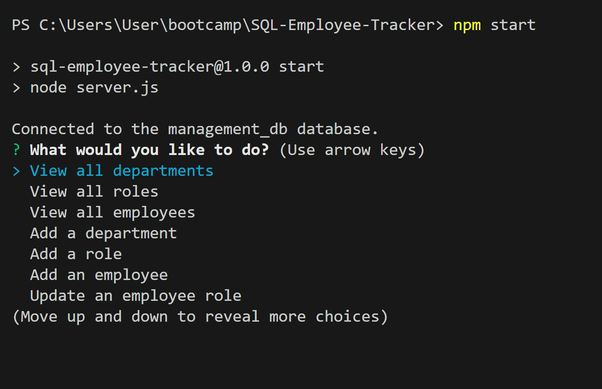
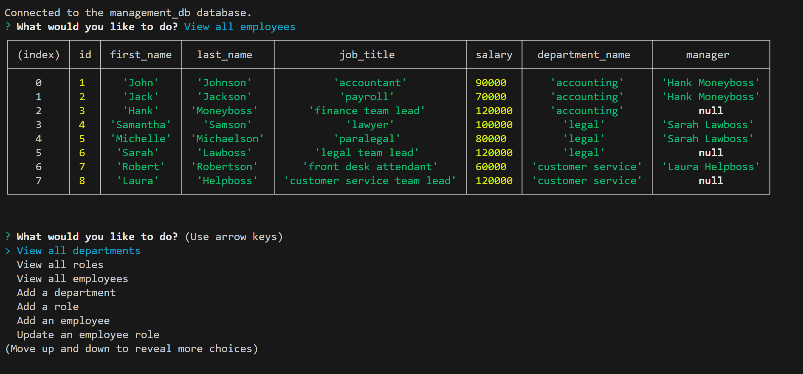
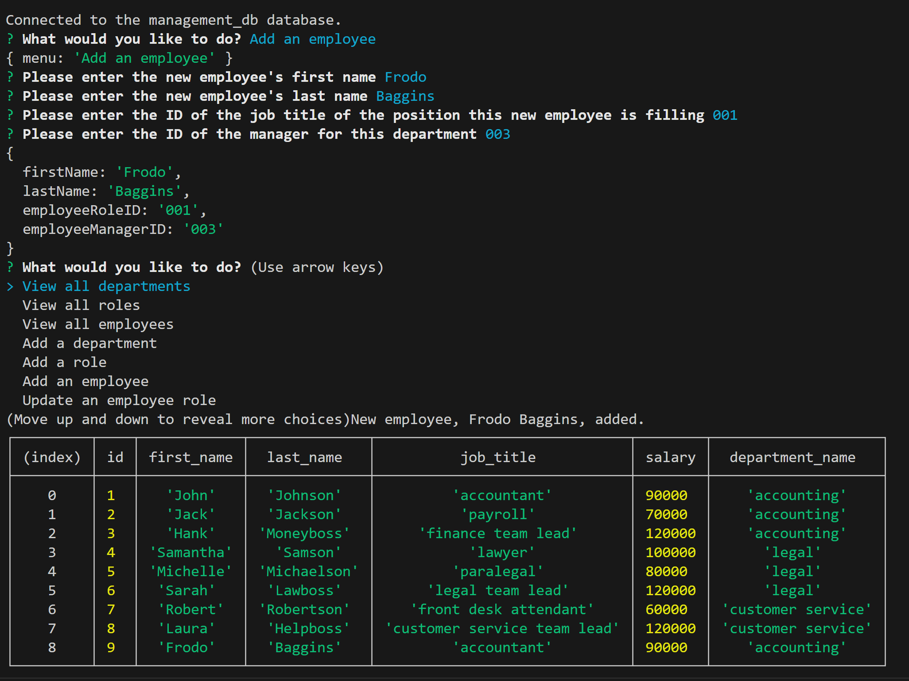

# SQL Employee Tracker
 
  
 
  ## Table of Contents
  
  [Description](#description)

  [Installation](#installation)
  
  [Usage](#usage)

  [Contribute](#contribute)

  [Test](#test)
  
  [Credits](#credits)
  
  [License](#license)

  [Questions](#questions)
  
  ## Description
  This is a command-line application that allows a user to manage the departments, roles, and employees for a company's database.

  ## Installation
  This application requires express.js, inquirer v 8.2.4, and mySQL2.

  ## Usage
  Users can start the application in the terminal with 'npm start'. They are then prompted with a menu of options for viewing the departments, roles, or employees tables, as well as options for adding departments, roles, employees, and updating roles for employees. Once they choose an option, they are either presented with the requested table, or are given a follow up prompt to answer. Once all follow up prompts are answered, the application will update the database accordingly. Users can exit out of the application by entering cntrl-c.

  
  
   

   [Screen Capture Demonstration: (https://drive.google.com/file/d/1SQgVB25tLlg61cTdjBRNsYr0QsnPzRhy/view)]
  
  ## Contribute

  [GitHub Repo: (https://github.com/AdamJohnson92/SQL-Employee-Tracker)]

  
  ## Credits
  The use of console.table() was advised by a former BSC student, Jack Price. Assistance with self joining the manager name to the manager ID in the view employees table and the concatination of the first and last name within was courtesy of BCS instructor, Rebecca Goldstein. The use of multiple select queries for updating an employee's role courtsey of BCS tutor, Faran Navazi.

  ## License
  
  
  
  This project utilizes mySQL2, express, and inquirer which are licensed under the terms of the MIT license.

  ## Questions?

  Contact me at:

  GitHub: https://github.com/AdamJohnson92
  
  email: adamgjohnson92@gmail.com
  